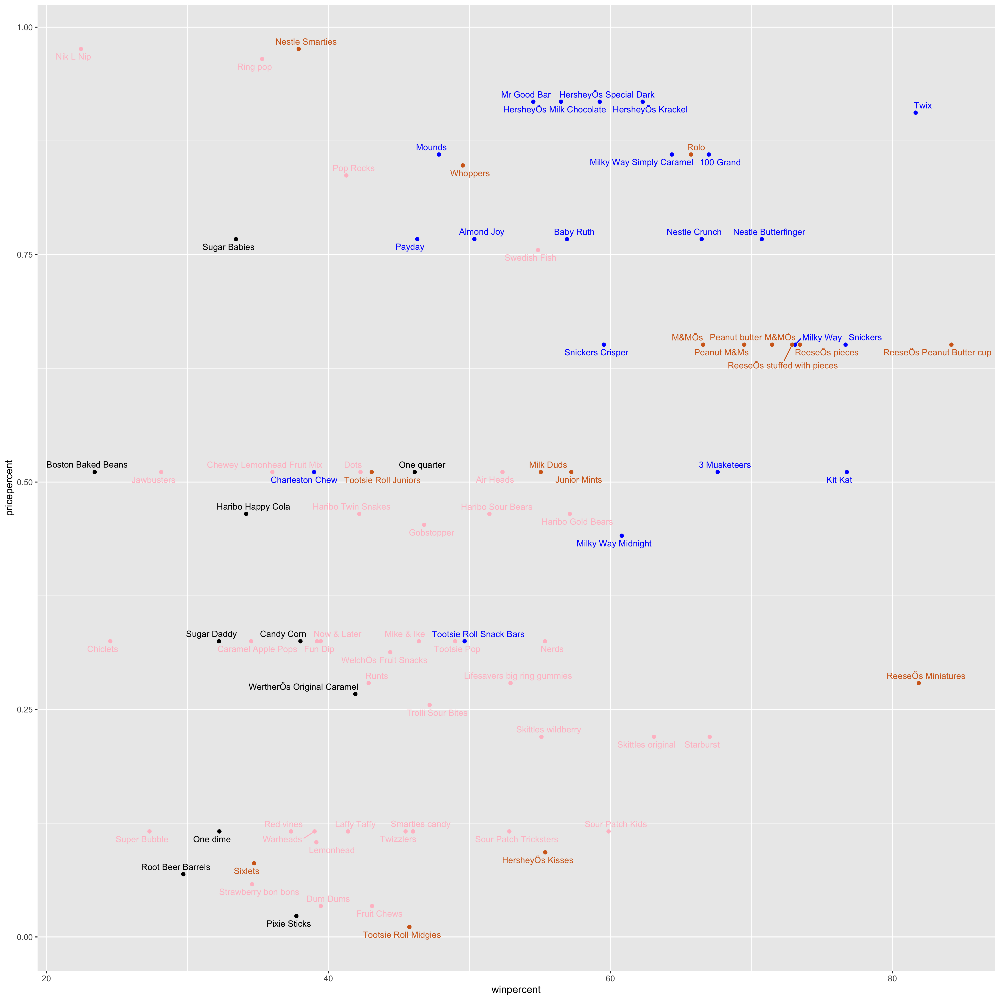
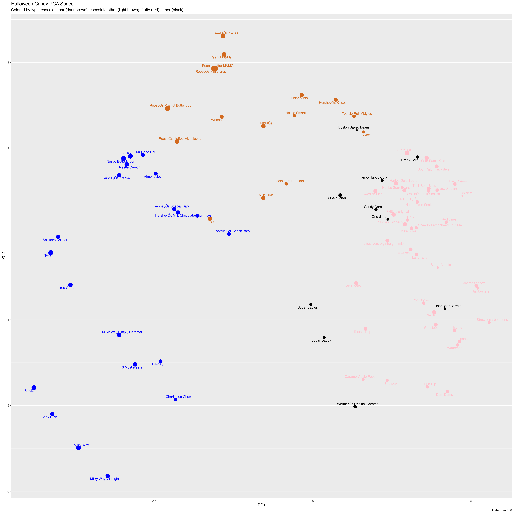

class10_Halloween_Mini_Project
================

## Importing Candy Data

``` r
candy_file <- "candy-data.csv"

candy = read.csv(candy_file, row.names=1)
head(candy)
```

                 chocolate fruity caramel peanutyalmondy nougat crispedricewafer
    100 Grand            1      0       1              0      0                1
    3 Musketeers         1      0       0              0      1                0
    One dime             0      0       0              0      0                0
    One quarter          0      0       0              0      0                0
    Air Heads            0      1       0              0      0                0
    Almond Joy           1      0       0              1      0                0
                 hard bar pluribus sugarpercent pricepercent winpercent
    100 Grand       0   1        0        0.732        0.860   66.97173
    3 Musketeers    0   1        0        0.604        0.511   67.60294
    One dime        0   0        0        0.011        0.116   32.26109
    One quarter     0   0        0        0.011        0.511   46.11650
    Air Heads       0   0        0        0.906        0.511   52.34146
    Almond Joy      0   1        0        0.465        0.767   50.34755

> Q1. How many different candy types are in this dataset?

To find this we can use `dim()`

``` r
dim(candy)
```

    [1] 85 12

There are 85 candy types.

> Q2. How many fruity candy types are in the dataset?

To find the fruity candy types, we can use `sum(candy$fruity)` to add
the number of fruity candy because true is equal to 1

``` r
sum(candy$fruity)
```

    [1] 38

## What is your favorite candy?

We can find the winpercent value for Twix by using its name to access
the corresponding row of the dataset. This is because the dataset has
each candy name as rownames (recall that we set this when we imported
the original CSV file). For example the code for Twix is:

``` r
candy["Twix", ]$winpercent
```

    [1] 81.64291

> Q3. What is your favorite candy in the dataset and what is it’s
> winpercent value?

My favorite candy are Sour Patch Kids. Its win percent is…

``` r
candy["Sour Patch Kids", ]$winpercent
```

    [1] 59.864

> Q4. What is the winpercent value for “Kit Kat”?

``` r
candy["Kit Kat", ]$winpercent
```

    [1] 76.7686

> Q5. What is the winpercent value for “Tootsie Roll Snack Bars”?

``` r
candy["Tootsie Roll Snack Bars", ]$winpercent
```

    [1] 49.6535

Installing Skimr

``` r
library("skimr")
x <- skim(candy)
x
```

|                                                  |       |
|:-------------------------------------------------|:------|
| Name                                             | candy |
| Number of rows                                   | 85    |
| Number of columns                                | 12    |
| \_\_\_\_\_\_\_\_\_\_\_\_\_\_\_\_\_\_\_\_\_\_\_   |       |
| Column type frequency:                           |       |
| numeric                                          | 12    |
| \_\_\_\_\_\_\_\_\_\_\_\_\_\_\_\_\_\_\_\_\_\_\_\_ |       |
| Group variables                                  | None  |

Data summary

**Variable type: numeric**

| skim_variable    | n_missing | complete_rate |  mean |    sd |    p0 |   p25 |   p50 |   p75 |  p100 | hist  |
|:-----------------|----------:|--------------:|------:|------:|------:|------:|------:|------:|------:|:------|
| chocolate        |         0 |             1 |  0.44 |  0.50 |  0.00 |  0.00 |  0.00 |  1.00 |  1.00 | ▇▁▁▁▆ |
| fruity           |         0 |             1 |  0.45 |  0.50 |  0.00 |  0.00 |  0.00 |  1.00 |  1.00 | ▇▁▁▁▆ |
| caramel          |         0 |             1 |  0.16 |  0.37 |  0.00 |  0.00 |  0.00 |  0.00 |  1.00 | ▇▁▁▁▂ |
| peanutyalmondy   |         0 |             1 |  0.16 |  0.37 |  0.00 |  0.00 |  0.00 |  0.00 |  1.00 | ▇▁▁▁▂ |
| nougat           |         0 |             1 |  0.08 |  0.28 |  0.00 |  0.00 |  0.00 |  0.00 |  1.00 | ▇▁▁▁▁ |
| crispedricewafer |         0 |             1 |  0.08 |  0.28 |  0.00 |  0.00 |  0.00 |  0.00 |  1.00 | ▇▁▁▁▁ |
| hard             |         0 |             1 |  0.18 |  0.38 |  0.00 |  0.00 |  0.00 |  0.00 |  1.00 | ▇▁▁▁▂ |
| bar              |         0 |             1 |  0.25 |  0.43 |  0.00 |  0.00 |  0.00 |  0.00 |  1.00 | ▇▁▁▁▂ |
| pluribus         |         0 |             1 |  0.52 |  0.50 |  0.00 |  0.00 |  1.00 |  1.00 |  1.00 | ▇▁▁▁▇ |
| sugarpercent     |         0 |             1 |  0.48 |  0.28 |  0.01 |  0.22 |  0.47 |  0.73 |  0.99 | ▇▇▇▇▆ |
| pricepercent     |         0 |             1 |  0.47 |  0.29 |  0.01 |  0.26 |  0.47 |  0.65 |  0.98 | ▇▇▇▇▆ |
| winpercent       |         0 |             1 | 50.32 | 14.71 | 22.45 | 39.14 | 47.83 | 59.86 | 84.18 | ▃▇▆▅▂ |

> Q6. Is there any variable/column that looks to be on a different scale
> to the majority of the other columns in the dataset?

The winpercent variable is on a different scale to the majority of the
other columns because it has a scale between 0 and 100 while the other
variables are between 0 and 1.

> Q7. What do you think a zero and one represent for the
> candy\$chocolate column?

For the candy\$chocolate column, a zero represents that there is no
chocolate in that particular candy and a one represents that there is
chocolate in that particular candy.

Plot a histogram of candy.

``` r
library(ggplot2)

ggplot(candy) + 
  aes(winpercent) +
  geom_histogram(bins = 15)
```


> Q9. Is the distribution of winpercent values symmetrical?

No, the distribution of winpercent values are not symmetrical as they
look to be skewed to the left.

> Q10. Is the center of the distribution above or below 50%?

The center of the distribution seems to be below 50%.

> Q11. On average is chocolate candy higher or lower ranked than fruit
> candy?

We can find the means of the winpercent of the different candies.

``` r
winPercentChoco <- mean(candy$winpercent[as.logical(candy$chocolate)])

winPercentFruit <- mean(candy$winpercent[as.logical(candy$fruity)])

winPercentChoco > winPercentFruit
```

    [1] TRUE

> Q12. Is this difference statistically significant?

``` r
t.test(candy$winpercent[as.logical(candy$chocolate)], candy$winpercent[as.logical(candy$fruity)])
```


        Welch Two Sample t-test

    data:  candy$winpercent[as.logical(candy$chocolate)] and candy$winpercent[as.logical(candy$fruity)]
    t = 6.2582, df = 68.882, p-value = 2.871e-08
    alternative hypothesis: true difference in means is not equal to 0
    95 percent confidence interval:
     11.44563 22.15795
    sample estimates:
    mean of x mean of y 
     60.92153  44.11974 

We can assume that the null hypothesis is false and that people prefer
chocolate over fruity candies.

## Overall candy Rankings

> Q13. What are the five least liked candy types in this set?

``` r
head(candy[order(candy$winpercent),], n=5)
```

                       chocolate fruity caramel peanutyalmondy nougat
    Nik L Nip                  0      1       0              0      0
    Boston Baked Beans         0      0       0              1      0
    Chiclets                   0      1       0              0      0
    Super Bubble               0      1       0              0      0
    Jawbusters                 0      1       0              0      0
                       crispedricewafer hard bar pluribus sugarpercent pricepercent
    Nik L Nip                         0    0   0        1        0.197        0.976
    Boston Baked Beans                0    0   0        1        0.313        0.511
    Chiclets                          0    0   0        1        0.046        0.325
    Super Bubble                      0    0   0        0        0.162        0.116
    Jawbusters                        0    1   0        1        0.093        0.511
                       winpercent
    Nik L Nip            22.44534
    Boston Baked Beans   23.41782
    Chiclets             24.52499
    Super Bubble         27.30386
    Jawbusters           28.12744

> Q14. What are the top 5 all time favorite candy types out of this set?

``` r
tail(candy[order(candy$winpercent),], n=5)
```

                              chocolate fruity caramel peanutyalmondy nougat
    Snickers                          1      0       1              1      1
    Kit Kat                           1      0       0              0      0
    Twix                              1      0       1              0      0
    ReeseÕs Miniatures                1      0       0              1      0
    ReeseÕs Peanut Butter cup         1      0       0              1      0
                              crispedricewafer hard bar pluribus sugarpercent
    Snickers                                 0    0   1        0        0.546
    Kit Kat                                  1    0   1        0        0.313
    Twix                                     1    0   1        0        0.546
    ReeseÕs Miniatures                       0    0   0        0        0.034
    ReeseÕs Peanut Butter cup                0    0   0        0        0.720
                              pricepercent winpercent
    Snickers                         0.651   76.67378
    Kit Kat                          0.511   76.76860
    Twix                             0.906   81.64291
    ReeseÕs Miniatures               0.279   81.86626
    ReeseÕs Peanut Butter cup        0.651   84.18029

> Q15. Make a first barplot of candy ranking based on winpercent values.

``` r
ggplot(candy) + 
  aes(winpercent, rownames(candy)) +
  geom_col()
```


> Q16. This is quite ugly, use the reorder() function to get the bars
> sorted by winpercent?

``` r
my_cols=rep("black", nrow(candy))
my_cols[as.logical(candy$chocolate)] = "chocolate"
my_cols[as.logical(candy$bar)] = "blue"
my_cols[as.logical(candy$fruity)] = "pink"


ggplot(candy) + 
  aes(winpercent, reorder(rownames(candy),winpercent)) +
  geom_col(fill = my_cols)
```


``` r
ggsave("candy_winpercent.png", height = 12, width = 12)
```


> Q17. What is the worst ranked chocolate candy?

Nik L Lips

> Q18. What is the best ranked fruity candy?

Reese’s Peanut Butter Cups

## Taking a look at pricepercent

Comparing the pricepercent value which ranks the candy based on how
expensive it is with the winpercent to try and find the best candy for
the most value.

``` r
library(ggrepel)

# How about a plot of price vs win
ggplot(candy) +
  aes(winpercent, pricepercent, label=rownames(candy)) +
  geom_point(col=my_cols) + 
  geom_text_repel(col=my_cols, size=3.3, max.overlaps = 40)
```


``` r
ggsave("price_vs_win.png", height = 15, width = 15)
```



> Q19. Which candy type is the highest ranked in terms of winpercent for
> the least money - i.e. offers the most bang for your buck?

It looks like Reese’s Minatures would have the most bang for your buck.

> Q20. What are the top 5 most expensive candy types in the dataset and
> of these which is the least popular?

``` r
ord <- order(candy$pricepercent, decreasing = TRUE)
head( candy[ord,c(11,12)], n=5 )
```

                             pricepercent winpercent
    Nik L Nip                       0.976   22.44534
    Nestle Smarties                 0.976   37.88719
    Ring pop                        0.965   35.29076
    HersheyÕs Krackel               0.918   62.28448
    HersheyÕs Milk Chocolate        0.918   56.49050

## Exploring the Correlation Structure

``` r
library(corrplot)
```

    corrplot 0.92 loaded

``` r
cij <- cor(candy)
corrplot(cij)
```


> Q22. Examining this plot what two variables are anti-correlated
> (i.e. have minus values)?

Two variables are anti-correlated are chocolate and fruity as if a candy
is chocolate it is not fruity.

> Q23. Similarly, what two variables are most positively correlated?

It looks like winpercent and chocolate are most positively correlated as
people are more likely to choose chocolate candies.

## Principal Component Analysis

Let’s do PCA on this dataset. We will use `prcomp()` function and set
`scale = T` because the winpercent and pricepercent values are on a
different scale.

``` r
pca <- prcomp(candy, scale = T)
summary(pca)
```

    Importance of components:
                              PC1    PC2    PC3     PC4    PC5     PC6     PC7
    Standard deviation     2.0788 1.1378 1.1092 1.07533 0.9518 0.81923 0.81530
    Proportion of Variance 0.3601 0.1079 0.1025 0.09636 0.0755 0.05593 0.05539
    Cumulative Proportion  0.3601 0.4680 0.5705 0.66688 0.7424 0.79830 0.85369
                               PC8     PC9    PC10    PC11    PC12
    Standard deviation     0.74530 0.67824 0.62349 0.43974 0.39760
    Proportion of Variance 0.04629 0.03833 0.03239 0.01611 0.01317
    Cumulative Proportion  0.89998 0.93832 0.97071 0.98683 1.00000

``` r
plot(pca$x[,])
```


Change plotting character and add some color.

``` r
plot(pca$x[,1:2], col=my_cols, pch=16)
```


Use ggplot to make a nicer plot.

``` r
# Make a new data-frame with our PCA results and candy data
my_data <- cbind(candy, pca$x[,1:3])

p <- ggplot(my_data) + 
        aes(x=PC1, y=PC2, 
            size=winpercent/100,  
            text=rownames(my_data),
            label=rownames(my_data)) +
        geom_point(col=my_cols)

p
```


Use the ggrepel package with labels on the points aswell.

``` r
p + geom_text_repel(size=3.3, col=my_cols, max.overlaps = 50)  + 
  theme(legend.position = "none") +
  labs(title="Halloween Candy PCA Space",
       subtitle="Colored by type: chocolate bar (dark brown), chocolate other (light brown), fruity (red), other (black)",
       caption="Data from 538")
```


``` r
ggsave("Halloween_Candy_PCA_Space.png", height = 20, width = 20)
```



> Q24. What original variables are picked up strongly by PC1 in the
> positive direction? Do these make sense to you?

The variables fruity, hard, and pluribus are picked up strongly by PC1
in the positive direction because usually if a candy is fruity, it is
also hard and comes in a lot, which is the opposite of chocolate candy.
